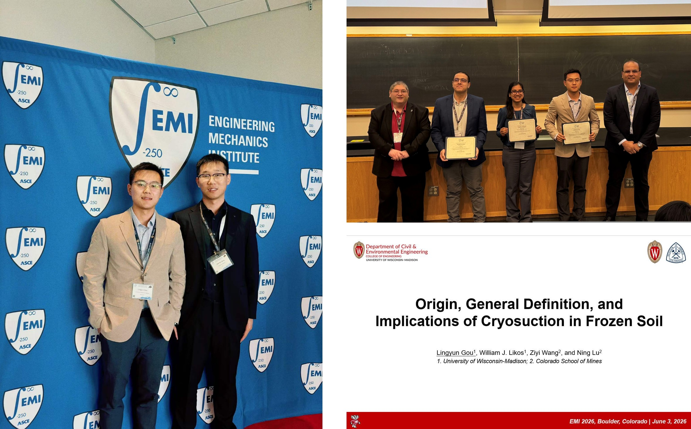

## News
- **2026** - Presented our latest research, *“Origin, General Definition, and Implications of Cryosuction in Frozen Soil”*, at the Engineering Mechanics Institute (EMI) 2026 Conference held at the University of Colorado Boulder. Received the **Runner-Up Award** in the [Poromechanics Student Paper Competition](https://www.asce.org/communities/institutes-and-technical-groups/engineering-mechanics-institute/news/2026-emi-student-competition-award-winners).

  

- **2026** — Our research article on [physics-informed digital twins for Arctic permafrost beneath roads](https://agupubs.onlinelibrary.wiley.com/doi/full/10.1029/2025JF008787) was selected as an AGU Editor’s Highlight and featured on [Eos](https://eos.org/editor-highlights/a-digital-twin-for-arctic-permafrost-beneath-roads).

  

- **2026** — Our work on [DMFS model](https://cdnsciencepub.com/doi/full/10.1139/cgj-2025-0364) was featured in the [Canadian Geotechnical Journal LinkedIn Spotlight](https://www.linkedin.com/feed/update/urn:li:activity:7438271024057470976/).

  

- **2025** — I attended the AGU 2025 Annual Meeting and presented our work on [failure mechanisms of permafrost bluffs in Alaska](https://ascelibrary.org/doi/full/10.1061/JGGEFK.GTENG-13950) and [differentiable modeling for permafrost](https://cdnsciencepub.com/doi/10.1139/cgj-2025-0364).

  

- **2024** — I attended the AGU 2024 Annual Meeting and presented our work on [a soil hydraulic conductivity model incorporating capillarity and adsorption](https://ascelibrary.org/doi/full/10.1061/JGGEFK.GTENG-11388).

  

