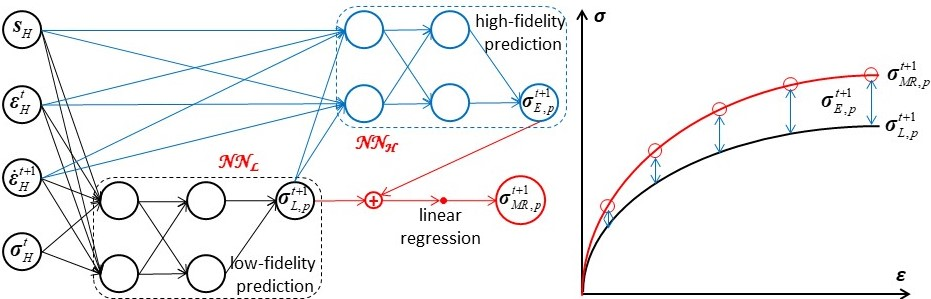
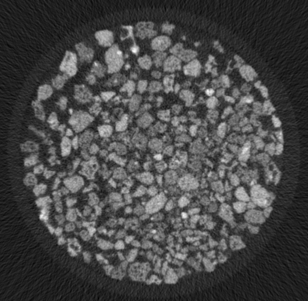
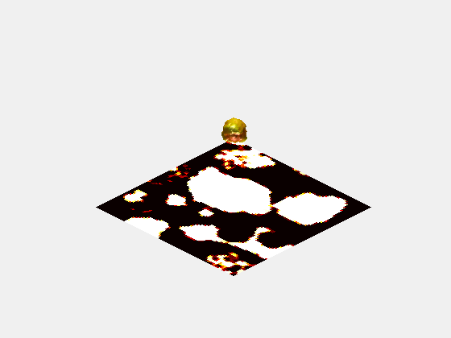

## Development of data-driven theory and methodology
- [Prior information based neural network (PiNet)](https://www.icevirtuallibrary.com/doi/abs/10.1680/jgeot.22.00046)
- [Multi-fidelity residual neural network (MRNN)](https://ascelibrary.org/doi/full/10.1061/%28ASCE%29EM.1943-7889.0002094)

## Identification of particulate characterizations
- [Recontruction of particles from computed-tomography(CT) images](https://ascelibrary.org/doi/full/10.1061/%28ASCE%29GT.1943-5606.0002790)
- [Machine learning assisted quantification of particle size and morphology](https://onlinelibrary.wiley.com/doi/full/10.1002/nag.3296)

CT image           |  Reconstruction
:-------------------------:|:-------------------------:
  |  

## Modelling of complex soil behaviours
- Anisotropy, path-dependent and rate-dependent

## Applications of data-driven models to engineering practice

## Machine learning assisted surrogate modelling
