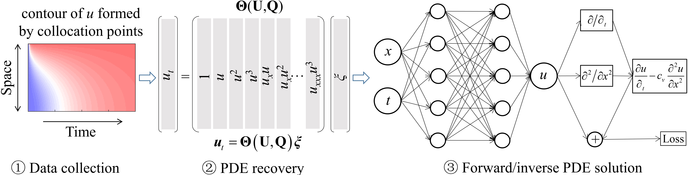
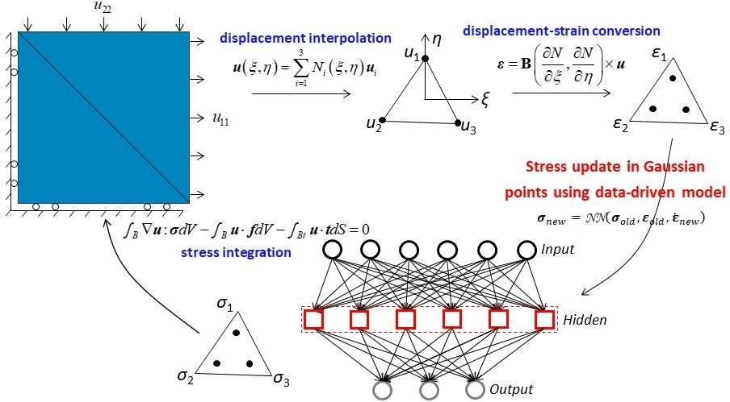
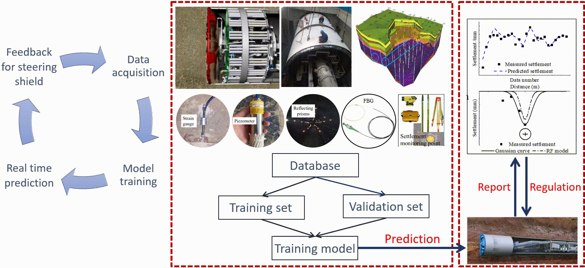

## Development of data-driven modelling theory and methodology
- [Prior information based neural network (PiNet)](https://www.icevirtuallibrary.com/doi/abs/10.1680/jgeot.22.00046): make more generalisable
- [Multi-fidelity residual neural network (MRNN)](https://ascelibrary.org/doi/full/10.1061/%28ASCE%29EM.1943-7889.0002094): adapt to sparse data
- [Bayesian neural network](https://cdnsciencepub.com/doi/abs/10.1139/cgj-2020-0751): uncertainty quantification

## Micromechanics
- [Recontruction of particles from computed-tomography(CT) images](https://ascelibrary.org/doi/full/10.1061/%28ASCE%29GT.1943-5606.0002790)
- [Machine learning assisted quantification of particle size and morphology](https://onlinelibrary.wiley.com/doi/full/10.1002/nag.3296)
- [Extract mechanical behaviours from images](https://www.sciencedirect.com/science/article/pii/S004578252100195X)

## Data-driven constitutive modelling of soil behaviours
- Anisotropy, path-dependent and rate-dependent
- [Finite element modelling with data-driven constitutive model](https://onlinelibrary.wiley.com/doi/abs/10.1002/nag.3370)
- [Physics-constrained data-driven surrogate model](https://ascelibrary.org/doi/full/10.1061/%28ASCE%29EM.1943-7889.0002094)

## In-situ monitoring and risk prediction
- [In-situ monitoring](https://ascelibrary.org/doi/abs/10.1061/%28ASCE%29GT.1943-5606.0002287) and [remote sensing](https://www.sciencedirect.com/science/article/abs/pii/S0886779819305711)
- [Big data analysis](https://www.sciencedirect.com/science/article/abs/pii/S1568494619306404) and [modelling of engineering practice](https://www.sciencedirect.com/science/article/abs/pii/S0926580518311488) 

