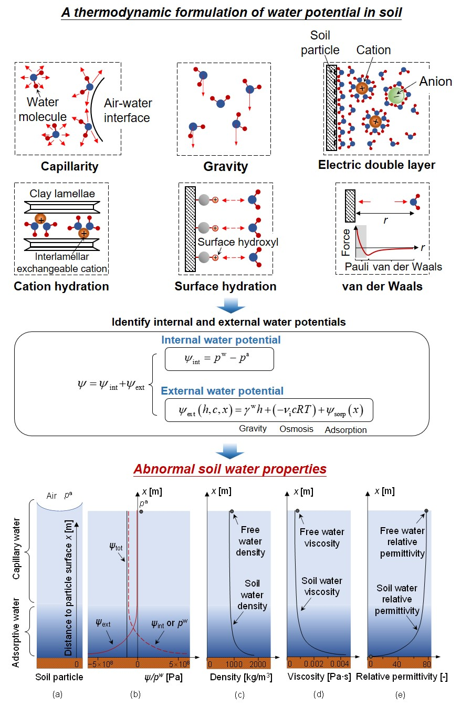
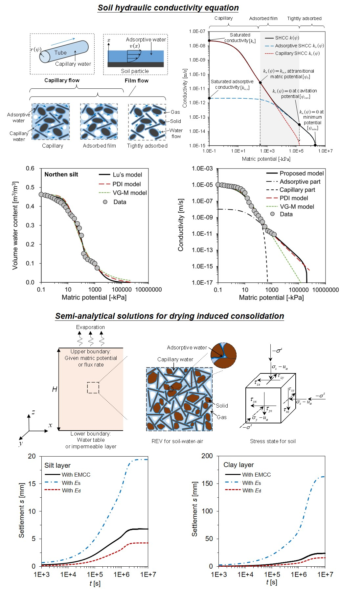
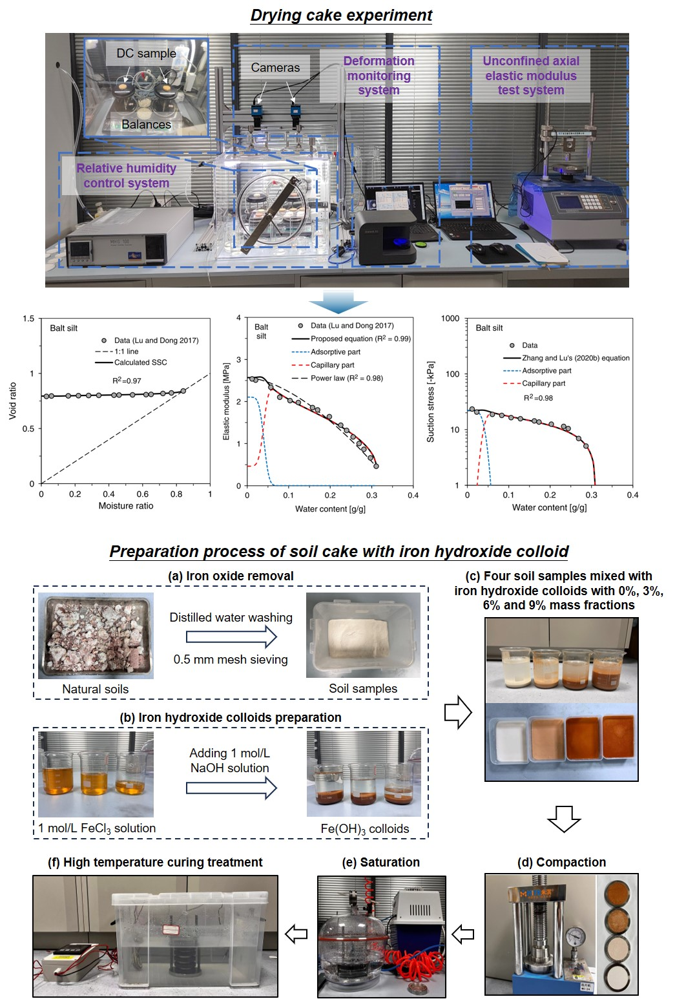
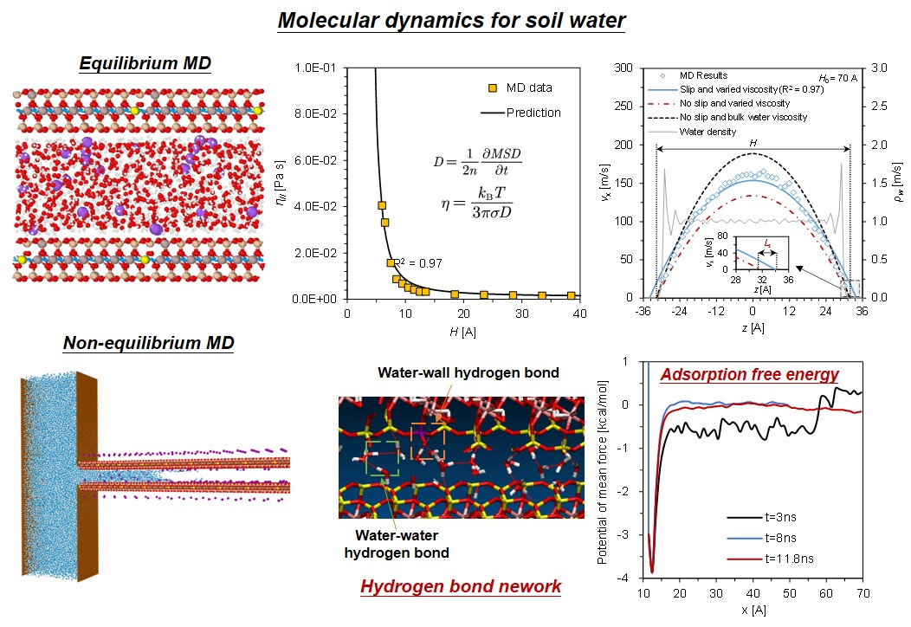

## Differentiable Modeling for Permafrost
Differentiable modeling (DM) provides a powerful paradigm for scientific computing by embedding unknown constitutive relationships or model parameters directly into physical models. Through automatic differentiation (AD) or implicit function theory (IFT), model-observation misfit can be backpropagated through numerical solvers, enabling unknown physical relationships to be learned directly from observational data.

Using this approach, we developed the [DMFS model](https://cdnsciencepub.com/doi/full/10.1139/cgj-2025-0364) the [δ-HT4P model](https://www.sciencedirect.com/science/article/pii/S0266352X26002387), and a [digital-twin framework](https://agupubs.onlinelibrary.wiley.com/doi/full/10.1029/2025JF008787) for permafrost prediction. Together, these studies demonstrate the potential of DM to integrate mechanistic process models, field observations, and scientific machine learning for cold-region geotechnical and geoscience applications.

## Theoretical Research in Free Energy Change of Soil Pore Water
- [Proposed a thermodynamic framework for water potential of soil](https://doi.org/10.1029/2022WR032369)

## Theoretical Research in Soil Hydraulic Behaviors
- [Established a soil hydraulic conductivity equation incorporating capillary and adsorptive film flow](https://doi.org/10.1061/JGGEFK.GTENG-11388)
- Developed a closed-form solution for film flow in nanoscale clayey soil pores with spatially varying viscosity
- [Developed a semi-analytical solutions for soil consolidation induced by drying](https://doi.org/10.1007/s11440-022-01623-4)

## Theoretical and Experimental Research in the Strength and Deformation of Unsaturated Soil
- [Extended the classic critical state soil mechanics to incorporate the effect of adsorptive suction stress](https://doi.org/10.1061/JGGEFK.GTENG-11798)
- Investigated the effects of iron oxide cementation on the mechanical properties of granite residual soil in the full suction range 
- Measured nanopore evolution in clay during drying via Small-Angle Neutron Scattering

## Exploring Microscale Soil-Water Interactions through Molecular Simulation
- Unveiled the physical origins of the abnormal high pore water viscosity
- Discovery of pore water flow induced by adsorption

